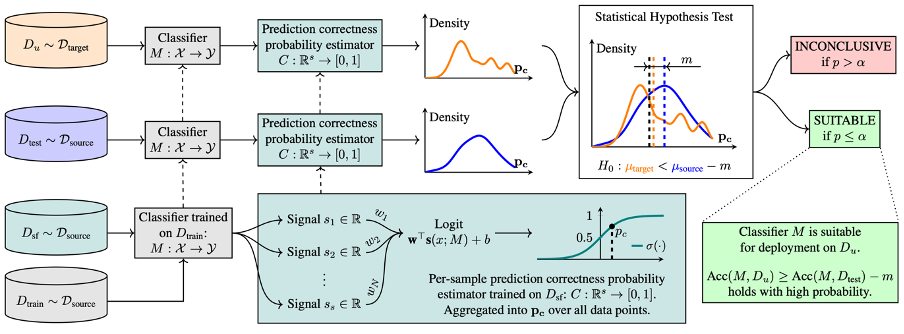
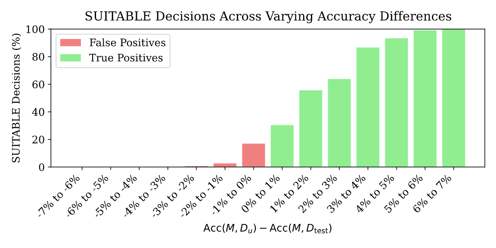

# Suitability Filter: Code Repository

[](https://opensource.org/licenses/MIT) 

This repository contains the official implementation for the paper:

**Suitability Filter: A Statistical Framework for Classifier Evaluation in Real-World Deployment Settings** \
*Angéline Pouget, Mohammad Yaghini, Stephan Rabanser, Nicolas Papernot* \
*Proceedings of the 41st International Conference on Machine Learning (ICML), PMLR 267, 2025.*

[Link to Paper] 

## Abstract

Deploying machine learning models in safety-critical domains poses a key challenge: ensuring reliable model performance on downstream user data without access to ground truth labels for direct validation. We propose the **suitability filter**, a novel framework designed to detect performance deterioration by utilizing **suitability signals**—model output features that are sensitive to covariate shifts and indicative of potential prediction errors. The suitability filter evaluates whether classifier accuracy on unlabeled user data shows significant degradation compared to the accuracy measured on the labeled test dataset. Specifically, it ensures that this degradation does not exceed a pre-specified margin `m`. To achieve reliable performance evaluation, we aggregate suitability signals for both test and user data and compare these empirical distributions using statistical hypothesis testing (non-inferiority testing), thus providing insights into decision uncertainty. Our modular method adapts to various models and domains. Empirical evaluations across different classification tasks demonstrate that the suitability filter reliably detects performance deviations due to covariate shift, enabling proactive mitigation of potential failures in high-stakes applications.

## Motivation

Machine learning models often encounter distribution shifts when deployed in the real world, leading to performance degradation. Monitoring this degradation is crucial, especially in high-stakes applications, but ground truth labels for user data are often unavailable, delayed, or expensive to obtain. Existing methods may detect distribution shifts or estimate accuracy, but don't directly address the critical question: *Is a pre-trained model still suitable for use on new, unlabeled user data, given an acceptable performance drop tolerance?*

## The Suitability Filter Framework

The Suitability Filter tackles this challenge by:

1.  **Defining Suitability:** A model `M` is deemed **suitable** for unlabeled user data `D_u` if its accuracy does not fall below its accuracy on a labeled test set `D_test` by more than a pre-defined margin `m`.
    `Acc(M, D_u) >= Acc(M, D_test) - m`
2.  **Leveraging Suitability Signals:** Extracting model-derived features (e.g., max softmax probability, predictive entropy, logit statistics) for each data point, which are correlated with prediction correctness and sensitive to shifts.
3.  **Estimating Prediction Correctness:** Training a lightweight **prediction correctness estimator** `C` (e.g., logistic regression) on a separate labeled holdout set (`D_sf`) to map suitability signals to a probability of the model's prediction being correct (`p_c`).
4.  **Comparing Distributions:** Applying `C` to both `D_test` and `D_u` to get distributions of `p_c`.
5.  **Statistical Testing:** Performing a **one-sided non-inferiority statistical test** (e.g., Welch's t-test) to check if the mean `p_c` on `D_u` is significantly lower than the mean `p_c` on `D_test` by more than the margin `m`.
    * *Null Hypothesis (H0):* `mean(p_c(D_u)) < mean(p_c(D_test)) - m` (Model is unsuitable)
    * *Alternative Hypothesis (H1):* `mean(p_c(D_u)) >= mean(p_c(D_test)) - m` (Model is suitable)
6.  **Making a Decision:** Outputting `SUITABLE` if H0 is rejected (p-value <= significance level `alpha`), otherwise `INCONCLUSIVE`.

<div align="center">
  
</div>

## Key Contributions & Features

1.  **Principled Framework:** Introduces suitability filters for detecting model performance deterioration during deployment using unlabeled user data.
2.  **Statistical Guarantees:** Leverages hypothesis testing to provide statistical grounding and control over the false positive rate (incorrectly deeming an unsuitable model as suitable) via a significance level `alpha`.
3.  **Theoretical Analysis:** Provides conditions (δ-calibration) and practical margin adjustments to maintain false positive rate control even with imperfect correctness estimators.
4.  **Empirical Validation:** Demonstrates effectiveness across extensive experiments (~29k) on challenging real-world distribution shift benchmarks (WILDS: FMOW, RxRx1, CivilComments).
5.  **Modularity:** The framework is adaptable to different signals, models, and potentially other performance metrics or testing scenarios (e.g., equivalence testing, continuous monitoring).

## Installation

1.  **Clone the repository:**
    ```bash
    git clone https://github.com/cleverhans-lab/suitability.git
    cd suitability
    ```

2.  **Create a virtual environment and install dependencies:**
    ```bash
    conda env create -f requirements.txt -n suitability_env
    conda activate suitability_env
    ```

## Usage

*TO BE CONTINUED*

The script will output the suitability decision (`SUITABLE` or `INCONCLUSIVE`) and other details like the p-value of the test.

## Experiments and Results
We evaluated the suitability filter extensively on datasets from the WILDS benchmark exhibiting real-world distribution shifts:

* **FMOW-WILDS:** Satellite imagery (temporal/geographical shifts)
* **RxRx1-WILDS:** Cellular microscopy (batch effects)
* **CivilComments-WILDS:** Text toxicity (subpopulation shifts)

Key findings include:

* The filter reliably detects performance drops. For example, on FMOW-WILDS, it achieves 100% accuracy in identifying performance deteriorations greater than 3% (for `m`=0, `alpha`=0.05) as can be seen in the figure below.
* Combining multiple suitability signals generally yields robust performance.
* Performance depends on factors like the magnitude of the accuracy difference, the chosen margin `m`, and the significance level `alpha`.

<div align="center">
  
</div>

Refer to the paper (Section 5 and Appendix A.4) for detailed results, ablations (signals, calibration, model choices), and analysis.

## Citation
If you find this work useful in your research, please cite our paper:

```bibtex
@inproceedings{pouget2025suitability,
  title={Suitability Filter: A Statistical Framework for Classifier Evaluation in Real-World Deployment Settings},
  author={Pouget, Ang{\'e}line and Yaghini, Mohammad and Rabanser, Stephan and Papernot, Nicolas},
  booktitle={Proceedings of the 41st International Conference on Machine Learning},
  volume={267},
  year={2025},
  publisher={PMLR}
}
```
